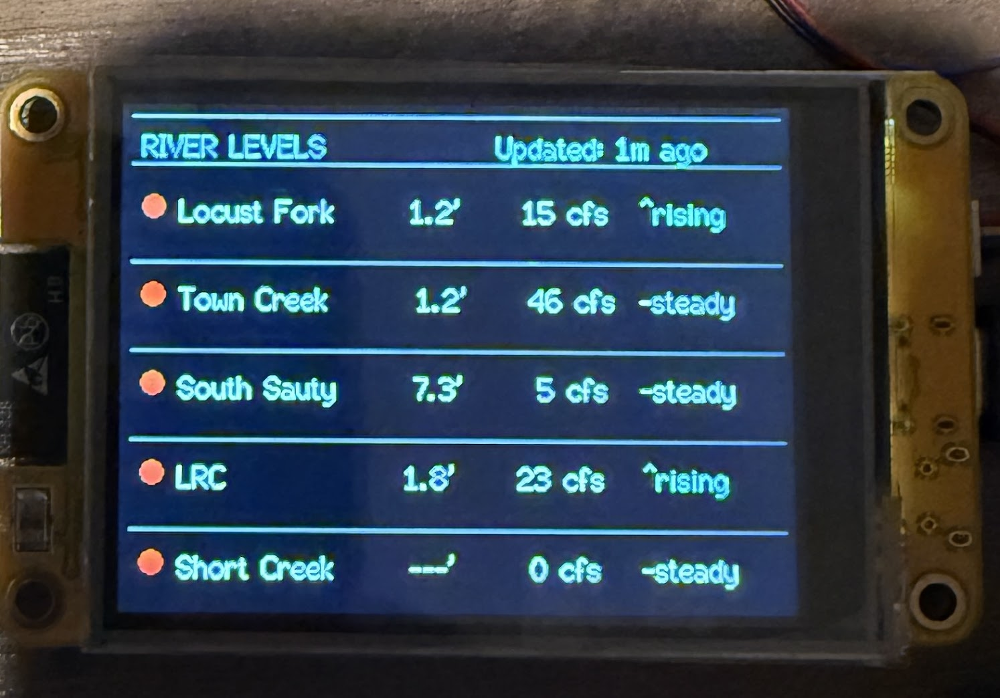

# ESP32-2432S028R River Levels Display



A whitewater kayaking river monitoring system that displays USGS river gauge data on an ESP32-2432S028R development board (also known as "Cheap Yellow Display" or CYD). Designed for paddlers to quickly check river conditions at a glance.

## Hardware

**ESP32-2432S028R Specifications:**
- ESP32 microcontroller (dual-core, WiFi enabled)
- 2.4" ILI9341 TFT display (320x240 pixels)
- Built-in touchscreen (XPT2046)
- USB-C programming interface
- Onboard voltage regulator
- Purchase: ~$15-20 on AliExpress/Amazon ("Cheap Yellow Display")

## Features

### Display Layout
- **Vertical card-style layout** showing 5 rivers:
  - Locust Fork
  - Town Creek
  - South Sauty
  - Little River Canyon (LRC)
  - Short Creek
- **Real-time updates**: API data refreshed every 5 minutes
- **Live countdown timer**: Shows time since last update (updates every 60 seconds)

### Data Displayed for Each River
- **Color-coded status indicator**: Green (in range), Red (too low), Yellow (warning)
- **River name**: Left-justified for easy reading
- **Water level**: Stage height in feet (e.g., "1.2'")
- **Flow rate**: Cubic feet per second (CFS), supports 1-4 digits
- **Trend**: Color-coded river trend
  - Cyan: "^rising"
  - Orange: "vfalling"
  - White: "-steady"

### Visual Design
- **Sky blue header**: "RIVER LEVELS" title
- **Cyan update timer**: "Updated: Xs ago" / "Updated: Xm ago"
- **Smooth anti-aliased fonts**: Using TFT_eSPI FreeFonts for professional appearance
- **Aligned columns**: sprintf formatting ensures perfect vertical alignment
- **Horizontal dividers**: Between river cards for visual separation
- **No bottom border**: Clean ending on last river

## Arduino CLI Usage

This project is designed to work with Arduino CLI for streamlined compilation and uploads.

### Compile and Upload in One Command
```bash
arduino-cli compile --upload -p /dev/ttyUSB0 --fqbn esp32:esp32:esp32 .
```

### Separate Compile and Upload
```bash
# Compile
arduino-cli compile --fqbn esp32:esp32:esp32 .

# Upload
arduino-cli upload -p /dev/ttyUSB0 --fqbn esp32:esp32:esp32 .
```

### Using Local Build Directory
To keep build artifacts in the project directory:
```bash
arduino-cli compile --build-path ./build --fqbn esp32:esp32:esp32 .
arduino-cli upload -p /dev/ttyUSB0 --fqbn esp32:esp32:esp32 --input-dir ./build .
```

### Find Your ESP32 Port
```bash
arduino-cli board list
```

## Setup Instructions

### 1. Install Arduino CLI

**Linux:**
```bash
curl -fsSL https://raw.githubusercontent.com/arduino/arduino-cli/master/install.sh | sh
```

**Or use Arduino IDE:**
Download from https://www.arduino.cc/en/software

### 2. Install ESP32 Board Support

**Using Arduino CLI:**
```bash
arduino-cli core update-index
arduino-cli core install esp32:esp32
```

**Using Arduino IDE:**
1. Go to **File > Preferences**
2. Add to "Additional Board Manager URLs":
   ```
   https://raw.githubusercontent.com/espressif/arduino-esp32/gh-pages/package_esp32_index.json
   ```
3. Go to **Tools > Board > Boards Manager**
4. Search for "esp32" and install

### 3. Install Required Libraries

**Using Arduino CLI:**
```bash
arduino-cli lib install "TFT_eSPI"
arduino-cli lib install "ArduinoJson"
```

**Using Arduino IDE:**
Go to **Sketch > Include Library > Manage Libraries** and install:
- **TFT_eSPI** by Bodmer
- **ArduinoJson** by Benoit Blanchon (version 6.x)

### 4. Configure TFT_eSPI Library

The TFT_eSPI library needs to be configured for the ESP32-2432S028R display.

**Automated Setup (Recommended):**
```bash
./install_tft_config.sh
```

**Manual Setup:**
1. Find your Arduino libraries folder:
   - Linux: `~/.arduino15/libraries/` or `~/Arduino/libraries/`
   - Windows: `Documents/Arduino/libraries/`
   - Mac: `~/Documents/Arduino/libraries/`

2. Copy the provided configuration:
   ```bash
   cp User_Setup.h ~/.arduino15/libraries/TFT_eSPI/User_Setup.h
   ```

### 5. Configure WiFi Credentials

Create or edit `secrets.h` with your WiFi information:

```cpp
const char* WIFI_SSID = "YourNetworkName";
const char* WIFI_PASSWORD = "YourPassword";
```

**Important:** Never commit `secrets.h` to a public repository! It's already in `.gitignore`.

### 6. Upload the Sketch

**Using Arduino CLI:**
```bash
arduino-cli compile --upload -p /dev/ttyUSB0 --fqbn esp32:esp32:esp32 .
```

**Using Arduino IDE:**
1. Connect the ESP32-2432S028R via USB-C cable
2. Select board: **Tools > Board > ESP32 Arduino > ESP32 Dev Module**
3. Select port: **Tools > Port > /dev/ttyUSB0** (or COM port on Windows)
4. Set Upload Speed: **Tools > Upload Speed > 921600**
5. Click the **Upload** button

## Pin Configuration (ESP32-2432S028R)

The ESP32-2432S028R has the following pin assignments:

| Function | Pin |
|----------|-----|
| TFT_MISO | GPIO 12 |
| TFT_MOSI | GPIO 13 |
| TFT_SCLK | GPIO 14 |
| TFT_CS   | GPIO 15 |
| TFT_DC   | GPIO 2 |
| TFT_RST  | Connected to board RST |
| TFT_BL   | GPIO 21 (backlight) |
| TOUCH_CS | GPIO 33 |

## API Endpoint

The sketch fetches data from:
```
https://docker-blue-sound-1751.fly.dev/api/river-levels
```

This API aggregates:
- USGS river gauge data (flow, stage, trend)
- Weather forecasts (QPF - Quantitative Precipitation Forecast)
- Temperature information
- In-range status based on paddling conditions

### Supported River Gauges (USGS Site IDs)
- **Locust Fork**: 02455000
- **Town Creek**: 03572900
- **South Sauty**: 03572690
- **Little River**: 02399200
- **Short Creek**: 03574500

## Code Structure

### Display Architecture
The code uses a clean card-based layout system:

```cpp
// Main display loop
displayRivers() {
  drawHeader()           // Sky blue title + update timer
  for each river:
    drawRiverCard()      // Status dot, data, divider
}

// Each card shows:
drawRiverCard() {
  - Status indicator (colored circle)
  - sprintf-formatted line with aligned columns:
    * River name (left-justified, 15 chars)
    * Level in feet (right-justified, 5 chars with ')
    * Flow in CFS (right-justified, 5 digits + "cfs")
    * Trend (fixed position, color-coded)
  - Horizontal divider (except last river)
}
```

### Font Rendering
Uses TFT_eSPI's smooth font system:
- **setFreeFont(&FreeSansBold18pt7b)**: Large titles
- **setFreeFont(&FreeSans12pt7b)**: Medium text
- **setTextFont(2)**: Built-in smooth font for data
- **setTextFont(1)**: Small details

### Alignment Strategy
Perfect column alignment achieved with `sprintf()`:
```cpp
sprintf(line1, "%-15s %5s  %5d cfs",
        riverName,    // Left-aligned in 15 chars
        levelStr,     // Right-aligned in 5 chars
        flowInt);     // Right-aligned in 5 chars
```

## Troubleshooting

### Display shows garbled output or wrong colors
- Run `./install_tft_config.sh` to copy the correct configuration
- Verify `User_Setup.h` is in the TFT_eSPI library folder
- Try setting `TFT_RGB_ORDER` to `TFT_RGB` if colors are swapped

### WiFi connection fails
- Verify SSID and password in `secrets.h`
- ESP32 only supports **2.4GHz WiFi** (not 5GHz)
- Monitor Serial output at 115200 baud for connection status
- Check for special characters in password that may need escaping

### Display is blank or backlight doesn't turn on
- Backlight controlled by GPIO 21
- Check `TFT_BACKLIGHT_ON` setting in `User_Setup.h`
- Some boards may have hardware backlight issues

### Compilation errors about TFT_eSPI
- Ensure only ONE setup is active in `User_Setup_Select.h`
- Delete and reinstall TFT_eSPI library
- Verify all required libraries are installed
- Check that `User_Setup.h` has correct pin definitions

### Data not updating
- Verify internet connectivity
- Check API endpoint is accessible: `curl https://docker-blue-sound-1751.fly.dev/api/river-levels`
- Monitor Serial output for HTTP error codes
- Ensure JSON parsing is successful (8192 byte buffer allocated)

### Port not found
```bash
arduino-cli board list
# Or manually check:
ls /dev/ttyUSB*
```

## Serial Monitor Output

Connect to serial monitor at **115200 baud** to see:
- WiFi connection status and IP address
- API fetch results (Success/HTTP error codes)
- River data updates with flow and trend
- JSON parsing errors (if any)
- Refresh timing information

**Arduino CLI:**
```bash
arduino-cli monitor -p /dev/ttyUSB0 -c baudrate=115200
```

## Project Structure

```
ESP32-2432S028R/
├── ESP32-2432S028R.ino           # Main sketch (current version)
├── User_Setup.h                   # TFT_eSPI configuration for CYD
├── secrets.h                      # WiFi credentials (gitignored)
├── install_tft_config.sh          # Automated TFT setup script
├── mock01.jpg                     # Display mockup/screenshot
├── README.md                      # This file
├── .gitignore                     # Excludes secrets.h, build files
└── build/                         # Build artifacts (optional)
```

## Design Evolution

This project started as a 2x2 grid layout and evolved into the current card-based vertical design:

### Version 1: 2x2 Grid (Initial)
- 4 rivers in quadrants
- Pixelated bitmap fonts
- Multiple data points per river (QPF, temperature)

### Version 2: Card Deck (Current)
- 5 rivers in vertical list
- Smooth anti-aliased fonts (TFT_eSPI FreeFonts)
- sprintf-based column alignment
- Simplified data display (status, level, flow, trend)
- Professional appearance with sky blue header
- Live update countdown timer

### Key Improvements
- **Better readability**: Smooth fonts vs bitmap
- **More rivers**: 5 instead of 4
- **Perfect alignment**: sprintf formatting
- **Cleaner design**: Removed unnecessary data (QPF, temp)
- **Status at a glance**: Color-coded indicators

## License

This project is open source. Feel free to modify and use it for your own paddling needs.

## References

- **ESP32-2432S028R Guide**: https://github.com/witnessmenow/ESP32-Cheap-Yellow-Display
- **TFT_eSPI Library**: https://github.com/Bodmer/TFT_eSPI
- **USGS Water Services**: https://waterservices.usgs.gov/
- **Arduino CLI**: https://arduino.github.io/arduino-cli/
- **ESP32 Arduino Core**: https://github.com/espressif/arduino-esp32

## Credits

Developed for whitewater kayakers by paddlers who need quick access to river conditions. Designed to sit on a desk or mount in a gear room for at-a-glance river status monitoring.

**Hardware**: ESP32-2432S028R "Cheap Yellow Display"
**API**: Custom USGS aggregation service on Fly.io
**Display**: Card-based design with smooth fonts and aligned columns
